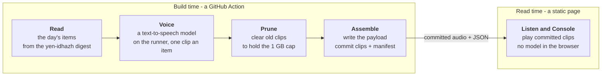

# yen-oli-kalari

**Last Updated**: 2026-09-11

**It reads the day's news digest aloud.**

yen-oli-kalari takes the daily digest that [yen-idhazh](https://github.com/miztiik/yen-idhazh) publishes and turns each item into audio. A GitHub Actions job reads the day's items, voices them with a text-to-speech model on the runner, commits the clips, and a static site on GitHub Pages plays them back.

*oli* is Tamil for sound. Where **yen-idhazh** ("my journal") writes the day down, **yen-oli-kalari** gives it a voice.

Nothing runs when you listen. The page is plain files, and the clip your browser plays was made hours earlier in CI. No text-to-speech model ever runs on your device.

The pipeline and the site are being built; the numbers below are measured, the surfaces are specified, and the code is landing.

---

## What it publishes

Two surfaces, both static:

| | |
| --- | --- |
| **Listen** | The day's items as rows, newest first, with one docked audio player. A row shows its title, its source (the link out), and its duration before you tap. Play a row and it loads into the single player; auto-advance is on by default, so the page plays the day as a station. A Topic spine filters the list and Tag chips narrow it. |
| **Every item gets a voice** | Not a top-N selection. A row not yet voiced says "No audio yet"; a row an older day's prune has cleared says "Audio cleared to make room". The item is never hidden - hiding it would make the day's list lie about the day. |
| **Console** | The operator's view: how many items were voiced, what failed, and what the day costs against the caps. The loudest card is **audio stored against the 1 GB cap**, because storage is the binding constraint. A retention card shows the oldest day still voiced, the clips cleared last run, and the bytes reclaimed. |
| **Nothing follows you** | No accounts, no analytics, no cookies, no third-party scripts, and no voice model downloaded to your browser. |

---

## How it works



The line between the two boxes is the whole design: **everything expensive happens before you arrive.** The clips are already committed; the page only plays them.

### The one rule that shapes everything

The pipeline runs on a stock GitHub runner - 4 vCPU, no GPU, a 6-hour job cap - and it publishes to a **1 GB** Pages site. That is not a budget to be raised; it is the platform.

For this project the wall is **storage, not compute**. Measured 2026-09-11 over 22 days of yen-idhazh output (8,772 items, 790,964 summary words):

- A median day is 370 items and about 222 minutes of speech.
- At opus@24k that is **40 MB a day, which fills the 1 GB Pages site in 26 days**.
- Compute has slack: a median day is 3.7 hours of speech, and only a real-time factor of 3.0 or worse busts the 6-hour job cap.

So the load-bearing stage is the one that decides what to keep. **The cap is held by an aggressive prune cycle, not by voicing fewer items** - every item gets a voice, and retention is a first-class stage. And because no model ships to the browser, the runner's voice model is chosen on speech quality, real-time factor and output bytes alone, and can be far larger than anything shippable to a page.

One number is assumed, not measured: the **150-words-a-minute** speaking pace. Every figure downstream of it - minutes, megabytes, days-to-full - is an estimate until a model is run on the target runner. A model that speaks at 130 words a minute moves all of them by about 15 percent.

---

## Documentation

Start here, in this order:

| If you want to know | Read |
| --- | --- |
| **What is settled, what is open, what to do next** | [`docs/getting-started/where-the-project-stands.md`](docs/getting-started/where-the-project-stands.md) |
| Which page answers my question | [`docs/reference/documentation-map.md`](docs/reference/documentation-map.md) |
| What this is and is not | [`docs/concepts/vision.md`](docs/concepts/vision.md) |
| The two surfaces, Listen and Console | [`docs/concepts/ui-shell.md`](docs/concepts/ui-shell.md) |
| What each pipeline stage owns | [`docs/concepts/pipeline-loop.md`](docs/concepts/pipeline-loop.md) |
| How a surface is judged good enough to ship | [`docs/concepts/design-system.md`](docs/concepts/design-system.md) |
| Real numbers from real hardware | [`docs/reference/measurements.md`](docs/reference/measurements.md) |
| The run that priced a day of audio | [`docs/reference/benchmarks/2026-09-11-input-volume-and-audio-cost.md`](docs/reference/benchmarks/2026-09-11-input-volume-and-audio-cost.md) |
| How to run the checks before a PR | [`docs/how-to/run-the-gates.md`](docs/how-to/run-the-gates.md) |
| What every top-level directory is for | [`docs/reference/repository-layout.md`](docs/reference/repository-layout.md) |
| Where any other doc belongs | [`docs/reference/documentation-structure.md`](docs/reference/documentation-structure.md) |

---

## Running it yourself

The daily pipeline (`python -m oli ...`) is being built. What runs today is the measurement that priced the design - two scripts that turn a checkout of yen-idhazh's output into the numbers above:

```bash
python backend/utilities/measure_input.py <path-to-yen-idhazh-checkout>   # items a day, summary length
python backend/utilities/calculate_audio_budget.py                                   # storage and time vs the caps
```

The first counts how many items arrive a day and how long their summaries are; the second prices what a day costs to store and to generate. Both print measured figures with the one assumption - the speaking pace - declared. The voice-model weights and any runtime binaries are downloaded, never committed.

## Repository layout

`backend/` produces and `frontend/` publishes. They meet only through committed files - the clips and their payloads - and the schemas generated from `backend/oli/contracts/`, never through a running service. Every directory is explained in [`docs/reference/repository-layout.md`](docs/reference/repository-layout.md).

## See also

- [`CLAUDE.md`](CLAUDE.md) - the engineering contract every change is held to.
- [`AGENTS.md`](AGENTS.md) - the pointer coding-agent tools start from.
- [`docs/concepts/vision.md`](docs/concepts/vision.md) - what this project is and is not.
- [`docs/archive/2026-09-11-listen-and-console-design-ruling.md`](docs/archive/2026-09-11-listen-and-console-design-ruling.md) - the paired UI ruling behind Listen and Console, archived once its rules were distilled into the concept docs.
